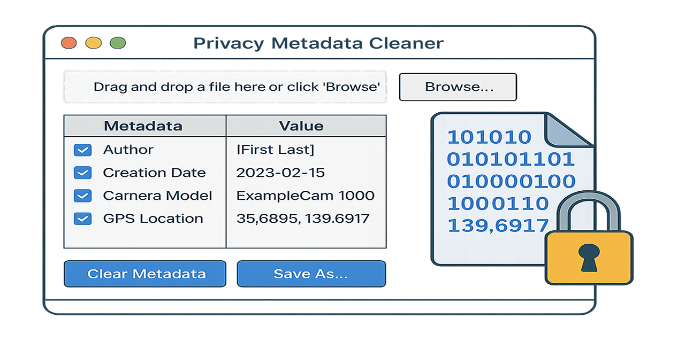

# Privacy Metadata Cleaner 🔐

||
|---|

This application allows you to analyze and remove metadata from files locally to ensure privacy and GDPR compliance.

<br>

---

<br>

## 💡 Features

- Remove EXIF from images (JPG, PNG)
- Clear metadata from PDF files
- Clean document properties in DOCX files
- Simple GUI (Tkinter)
- 100% local and offline
- No data ever leaves your device

<br>

---

<br>

## 🛠️ Requirements

- Python 3.10+
- pip install -r requirements.txt

<br>

---

<br>

## 🚀 Run the App

```bash
python main.py
```

<br>

---

<br>

## 🔐 Supported File Types

- `.jpg`, `.jpeg`, `.png`
- `.pdf`
- `.docx` (Excel and PowerPoint planned)

